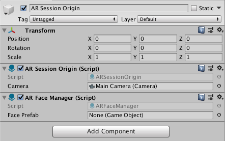

## Face Tracking support

For face tracking, ARFoundation introduces another AR Manager called `ARFaceManager`, which you can add as a component on to `ARSessionOrigin`'s' `GameObject`. This component will manage the addition, updating, and removal of `GameObject`s to represent faces. 

`ARFaceManager` subscribes to relevant AR Face Subsystem events, such as `faceAdded`, `faceUpdated`, and `faceRemoved`, and creates `GameObject`s for each detected trackable face. The generated `GameObject`s are parented to a special `GameObject` under the `ARSessionOrigin`, accessible via `ARSessionOrigin.trackablesParent`.

`ARFaceManager` also accepts an optional prefab, which will be instantiated to represent the face. If no prefab is specified, a `GameObject` is created with an `ARFace` component.

The `ARFace` component stores information about the trackable face, but does not visualize it. Its `Transform` is updated by its manager whenever the AR device reports an update.  It has a session-unique `TrackableId` associated with it, and you can access an individual face by id through its manager.

### Visualizing Faces

To do something with the generated faces, subscribe to the appropriate event on the `ARFace` component.

An `ARFace` has the following events:

| Event | Description |
|-|-|
| `added`   | Invoked when a face is added |
| `updated` | Invoked when a face is updated |
| `removed` | Invoked when a face is about to be removed. |

You can then add any prefab as a child of this `GameObject` and it will render at the position and orientation of your face.

#### ARFaceMeshVisualizer

To visualize faces, you'll need to create a prefab or `GameObject` which includes a component that subscribes to `ARFace`'s `added`, `updated` and `removed` events. `ARFoundation` includes such a component: `ARFaceMeshVisualizer`. This component will generate a `Mesh` from the mesh vertices of a face trackable and assign it to a `MeshCollider` and `MeshFilter`, if present.

There is a menu item `GameObject > XR > AR Default Face` which will create a new `GameObject` which you can use to create your prefab.

Once created, you should assign it to the `ARFaceManager`'s `Face Prefab` field. You can use it directly or create a prefab by dragging the `GameObject` into your Assets folder.  It is recommended to save the `AR Default Face` as a prefab first, delete the `AR Default Face` GameObject, and then use that in the prefab field as leaving the face in your scene will leave a zero scale plane artifact in the scene.

 
